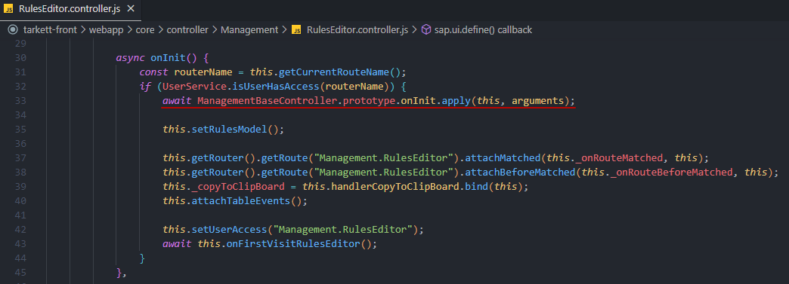
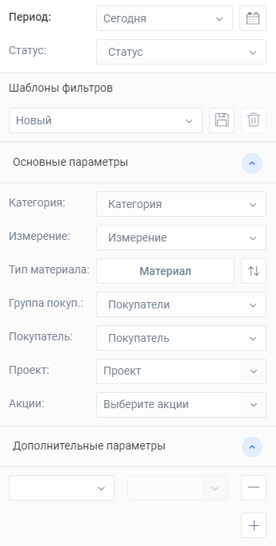

# Проектные знания Tarkett

Перед тем, как начать работу по проекту необходимо ознакомиться с [Git Flow](https://dev.pyrobyte.ru/git/pyrobyte-knowledge-base/-/wikis/home/common/git-flow).

### Глоссарий по основным папкам

В разделе `webapp` находятся основные файлы проекта:

- `API` - эндпоинты для отправки запроса к API;
- `asstets` - файлы стилей, изображений, шрифтов;
- `base` - Основные модули программной логики, а также модули, которые могут использоваться из любого места проекта;
- `constants` - основные константы проекта;
- `controls` - модули кастомных контролов;
- `core` - корневая папка проекта;
- `helpers` - вспомогательные методы и функции, которые могут использоваться в любом месте проекта (методы форматирования даты, деревьев, улучшенный метод использования try/catch);
- `i18n` - файлы локализации (языковая поддержка для разных стран);
- `libraries` - модули библиотек;
- `services` - модули вспомогательной работы с контроллерами;
- `settings` - файлы настроек доступа;
- `test` - модули для работы с тестированием программной логики;
- `widgets` - виджеты проекта.

### Работа с версткой

Верстка на Tarkett - это еще один камень предкновения, который вводит в заблуждение начинающих разработчиков. Самой правильной тактикой в данном случае будет держать [документацию](https://sapui5.hana.ondemand.com/#/api) под рукой.

У любого контрола есть такое понятие, как [Properties](https://sapui5.hana.ondemand.com/#/api/sap.m.Button%23controlProperties). Это аналог атрибутов в html. Также в `properties` дополнительно можно указать [Events](https://sapui5.hana.ondemand.com/#/api/sap.m.Button%23events/Summary).

### Работа с программной логикой проекта

Работа по добавлению/изменению программной логики ведется на JavaScript.

Конечно то, за что отвечает функция должно быть понятно из ее названия, но чтобы внести еще большую ясность используется формат [JSDoc](https://jsdoc.app/tags-example.html).

Если вы вносите какие-либо изменения в уже существующий функционал настоятельно рекомендую разобраться в том, как это работает на данный момент. Чем глубже вы вникнете в этот функционал, тем точнее сможете внести изменения. Также это убережет вас от добавления излишнего функционала, который уже и так используется.

Один из главных признаков того, что вы остановились при выполнении задачи - вы не до конца вникли в поведение данного функционала. Вы не до конца поняли как это должно работать.

Если же вы добавляете новый функционал, то советую продумать хорошенько (если надо, то на бумаге) всевозможные вариации, когда будет применяться данный функционал. Здесь принцип действия такой же, как и при внесении изменений - чем глубже продумаете, тем точнее получится.

### Команды NPM

Для работы с проектом Tarkett используется NodeJS v14.17.6

Список команд для запуска скриптов:

- `start`- запуск таскранера GULP, изменение файлов стилей в момент их сохранения;
- `build` - формирование актуального Components-preload.js и файлов стилей;
- `styleBuild` - сборка акутальных файлов стилей;
- `test` - запуск unit тестов в консольном режиме;
- `critical-test` - запуск критических unit тестов в консольном режиме;
- `deploy` - изменение файлов для актуализации кеша и использование команды build;
- `change-configuration` - обновление файла конфигурации. Принимает следующий аргумент **_path_** (toDevelopment или toProduction)

        Пример использования: npm run change-configuration --path=toProduction

- `change-version` - смена версии проекта и запуск команды deploy. Нужно указать два аргумента:

  - старая версия (--old-version) - 1.70.0;
  - новая версия (--new-version) - 1.71.0.

        Пример использования: npm run change-version --old-version=1.70.0 --new-version=1.71.0

- `production-build` - переключение api с dev режима на prod режим;
- `development-build` - переключение api с prod режима на dev режим.

## Практики по контроллерам

При работе с программной логикой некоторые контроллеры используют дополнительный уровень абстракции. Основные причины использования таких конструкции - возможность переиспользования методов и компонентов верстки в разных разделах проекта. Такие контроллеры находятся в папке `base` с наименованием соответствующего раздела. Модель у таких контроллеров тоже будет общая

### Согласование цен

Раздел согласования цен имеет родительский контроллер `ManagementBaseController.js` и модель `ManagementBaseModel.js`. Контроллеры страниц **_Редактор правил_**, **_Цены_**, **_Продление правил_** наследуются от него.

Попадая на какую-либо из этих страниц вызывается метод `onInit` у `ManagementBaseController.js`:

Реализован подобный подход как раз из-за того, что на этих страницах запрашиваются одинаковые параметры:

### Бизнес процессы

Раздел бизнесс процессов имеет родительский контроллер `ProcessBaseController.js`. Он сочетает в себе общие методы, которые используются при просмотре процесса (`Process.controller.js` и `Base.controller.js`). Также содержит методы, которые требуются при просмотре документа (`ViewDocumentBase.controller.js`) и в разделе поиска/создания документов (`Documents.controller.js`).

Акцентирую внимание на `Process.controller` и `Base.controller`. В зависимости от адаптива (десктопной или мобильной версии просмотра процесса) методы могут использоваться от одного из этих модулей. Поэтому было принято решение вынести их в общий контроллер.

### Настройки

Страница **_Управления сервисами_** имеет общий родительский контроллер `UsersManagementBaseController.js`. Разработка данной страницы продолжается, но решение создать общий контроллер было принято ввиду наличия подстраниц данного раздела: **_Список пользователей_**, **_Группы пользователей_**, **_Уровни доступа_**, **_Настройка привилегий_**, **_Настройка структуры пользователей_**, **_Контроль событий по пользователю_**. На этапе разработки уже использовались общие методы, которые вынесены в общий контроллер.
