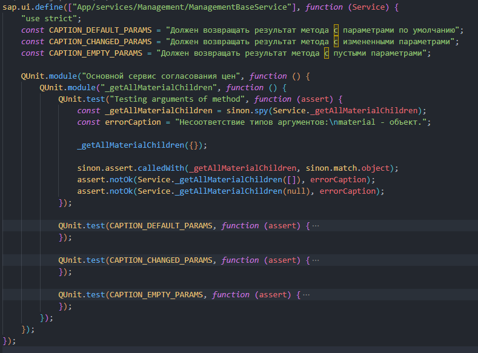
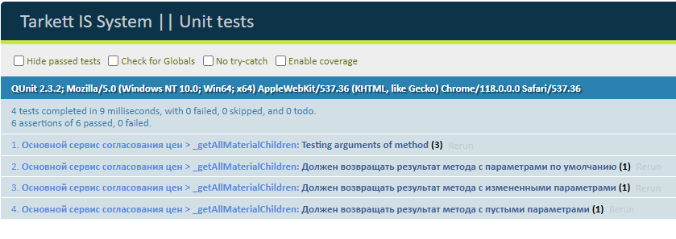

## Unit тесты

В качестве библиотеки для **_unit_** тестов используется [sinon](https://sinonjs.org/).

Модули для тестов находятся в одноименной папке корневого пути проекта `test`.
Структура расположения папок следующая:

- `API` - модули для тестирования методов API;
- `modules` - модули описания тестирования методов контроллеров, сервисов, хелперов, критические тесты;
- `unit` - главные модули unit тестов. Подключения контроллеров, сервисов, хелперов
  к библиотеке тестирования;

### Общий процесс описания тестов

Методика описания тестов ведется по [TDD](https://habr.com/ru/companies/ruvds/articles/450316/).

1. Если модуль, в котором лежит инетересующий нас метод, не подключен, то следует его подключить в главный файл тестирований `test/unit/allTest.js`. В папке `modules` также создается новый файл для тестов.
2. Когда файл уже создан, то задается следующая структура описания тестов:

где:

- константы - описание параметров, с которыми отрабатывает метод:

  - CAPTION_DEFAULT_PARAMS - отработка метода с параметрами по умолчанию;
  - CAPTION_CHANGED_PARAMS - отработка метода с измененными параметрами;
  - CAPTION_EMPTY_PARAMS - отработка метода с пустыми параметрами.

- Первый уровень вложенности - описание местополжения в котором проводятся тесты (Основной сервис согласования цен)
- Второй уровень вложенности - название метод, покрытого тестами (\_getAllMaterialChildren);
- QUnit.test - непосредственно сами тесты для метода;

3. Чтобы посмотреть результат работы тестов нужно открыть файл `test/unit/index.html`.

